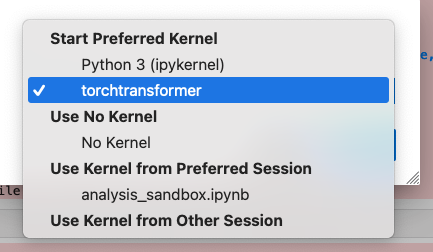

# envs
Some notes of managing unique environment related issues

# Setting up kfp

Installing kfp [kubeflow pipelines](https://www.kubeflow.org/).

The kfp package is installed via pip and we want to install it in a
conda environment.

kfp in mainly installed using the pip tool.

Starting the conda environmemnt and running pip install kfp, the
installation goes to the root python package. That is the python that
is outside of the conda environment. This means when pip is installed
in the conda environment, the import fails because pip installed the
package outside of the environment.

A solution is to use pip that is in the conda environment to install
the package. Pip should be install in the pip environment if pip it is
not installed

`conda install pip`

Using the conda version of pip to install the package will install the
package in the given environment.

`/home/ubuntu/miniconda3/envs/kfp/bin/pip install kfp`

Confirm that the package is installed in the right python's site packages

```bash
(kfp) ubuntu@tfserver-gpu:~$ pip show kfp
Name: kfp
Version: 2.7.0
Summary: Kubeflow Pipelines SDK
Home-page: https://github.com/kubeflow/pipelines
Author: The Kubeflow Authors
Author-email: 
License: 
Location: /home/ubuntu/miniconda3/envs/kfp/lib/python3.12/site-packages

Requires: click, docstring-parser, google-api-core, google-auth,
google-cloud-storage, kfp-pipeline-spec, kfp-server-api, kubernetes,
protobuf, PyYAML, requests-toolbelt, tabulate, urllib3

Required-by:
```

# Setting up a remote Jupyter session and accessing it locally

We can use port forwarding to create a remote jupyter session and
access the notebook from a local browser. This is enabled by port
forwarding.

The general command that should be run on the local machine

`ssh -L local_port:localhost:remote_port username@remote_server`

**local_port**: The port on your local machine where you want to access the Jupyter Notebook.
**remote_port**: The port on the remote server where the Jupyter Notebook is running.
**username**: Your username on the remote server.
**remote_server**: The address or hostname of the remote server.

Since our remote server is accessed through ssh keys, we need to
modify the command with the following:

`ssh -N -f -L 8889:localhost:8889 username@remoteserver -i ~/.ssh/<keyfile>.key`

Then launch the jupyter notebook server in the remote server using a
headless approach

` jupyter notebook --no-browser --port=8889`

Ensure traffic to that port is allowed on the remote machine by
configuring the security group info (CSC cpouta) to allow(ingress) to
that port from a given IP address(es).


# Virtual environments within Jupyter

In some cases, we want to open jupyter within a given virtual
environment which contains pre-installed dependencies. This can be
done by "Select Kernel" drop down menu. However, the virtual
enviroments are not listed as options by default.



Instead, Jupyter loads the native python kernel by default. To ensure
other environments are accessible to jupyter, the environments need to
be installed.

Ensure ipykernel installed, and the correct pip is used. global pip vs
conda environment specific pip. If the environment does not have its
own pip, install and ensure it is used in the environment specific
installations.

```bash
pip install ipykernel

/home/<user>/miniconda3/envs/torchtransformer/bin/pip install ipykernel
```

Then install the environment to the ipython kernel which can be
accessed by the jupyter session.

`ipython kernel install --user --name=torchtransformer`